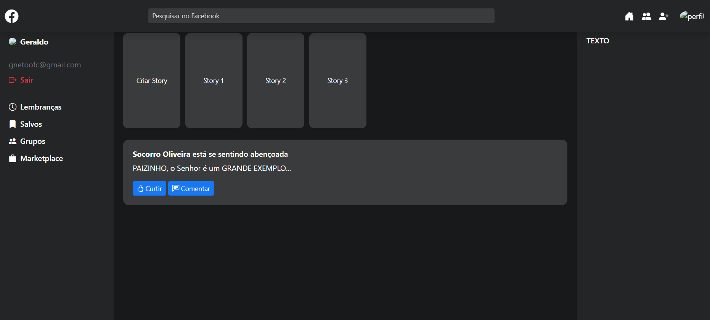
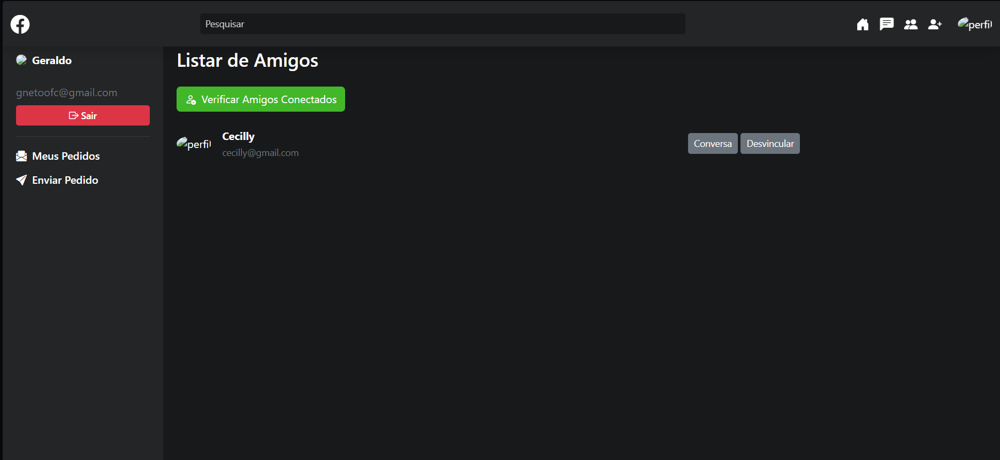

# 📱 Mini Rede Social

Este projeto é uma **mini rede social estilo Facebook**, onde os usuários podem:

- Criar conta e fazer login  
- Procurar amigos  
- Enviar e aceitar solicitações de amizade  
- Recusar solicitações  
- Ver a lista de amigos disponíveis  

---

## 🚀 Tecnologias Utilizadas
- **Java (Servlets e JSP)**  
- **HTML5**  
- **CSS3**  
- **Bootstrap**  
- **MySQL**  
- **Eclipse IDE**  

---

## 🖼️ Imagens do Projeto

### 🔹 Tela após login

### 🔹 Tela de amigos (encontrar e gerenciar solicitações)

## 📌 Funcionalidades

- Login e logout de usuários

- Enviar solicitação de amizade

- Aceitar solicitação de amizade

- Recusar solicitação de amizade

- Ver amigos disponíveis

## 📚 Aprendizados

- Este projeto foi desenvolvido com o objetivo de praticar:

- Programação web com Java, Servlets e JSP

- Estrutura de banco de dados relacional com MySQL

- Integração de frontend (Bootstrap) com backend em Java

👨‍💻 Autor

Desenvolvido por Geraldo Neto
